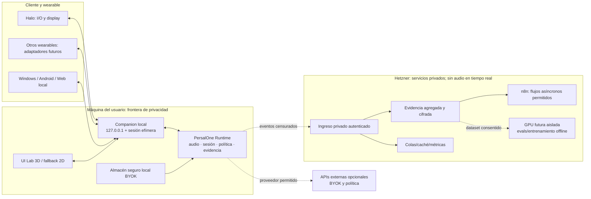
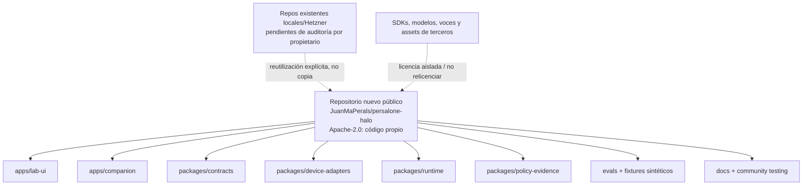

# PersalOne Runtime — arquitectura maestra y plan de ejecución

**Estado:** borrador de arquitectura; pendiente de aprobación de Juan Ma Perals antes de reanudar desarrollo, despliegue o cambios de infraestructura.  
**Fecha:** 24 de julio de 2026.  
**Principio de verdad:** `DOCUMENTED` no significa `MEASURED`; una simulación nunca se presenta como capacidad física.  
**Ámbito:** Runtime común para Companion local, simulador, Halo primero y futuros adaptadores de otros wearables. ES↔EN es el único par inicial sujeto a validación.

> Esta arquitectura sustituye cualquier lectura de que la GUI 3D, un ACK de software o una documentación de fabricante demuestren audio, latencia, autonomía, duplex o preservación de voz en hardware.

## 1. Estado actual verificable

### 1.1 Entorno Hetzner correcto

| Hecho | Evidencia | Estado |
|---|---|---|
| Proyecto Hetzner con servidor existente | Captura de la consola de Hetzner del usuario, 24-07-2026 | `MEASURED` visual |
| Servidor | `persalone-prod-01`, activo | `MEASURED` visual |
| Perfil visible | La lista mostró CPX52/8 vCPU/16 GB; la ficha detallada mostró 12 vCPU/24 GB/480 GB | `CONFLICTING`: no presupuestar hasta reconciliar |
| Acciones tomadas por este trabajo | Ninguna: sin creación, resize, red, firewall, reinicio, despliegue ni borrado | `MEASURED` por registro de acciones |
| Acceso SSH verificable en esta fase | Alias anterior dejó de resolver; no se ha adivinado IP ni escaneado la red | `BLOCKED` hasta que Juan facilite un endpoint/autorización estable |

Una auditoría SSH anterior observó Debian 13, 8 CPU, ~15 GiB de RAM disponible para el SO, 8 GiB de swap (con ~5.6 GiB usada en ese instante) y ~305 GiB libres en el volumen raíz. El 24-07-2026 se demostró que el alias usado para esa auditoría **no corresponde a `persalone-prod-01`**: su IP no coincide con la instancia Hetzner visible. Por tanto, esos datos se conservan únicamente como evidencia de un VPS fuera de alcance y no se usan para presupuestar PersalOne Runtime. La capacidad real de `persalone-prod-01` queda bloqueada hasta disponer de API/CLI de lectura o SSH verificado al host exacto.

### 1.2 Servicios detectados en la auditoría previa

Se observaron contenedores o servicios relacionados con: n8n y monitor regulatorio, PostgreSQL, Qdrant, OpenObserve, Uptime Kuma, CISO Assistant, DocuSeal, un gateway de agentes, runners de GitHub Actions, Docker, PM2, Nginx, Tailscale, Cloudflared, Wazuh y otros servicios existentes. Esta lista es un inventario, **no una autorización para reutilizarlos**.

Consecuencia: el servidor no es un lienzo vacío. Antes de cualquier Runtime de PersalOne hay que confirmar propietarios, límites de memoria/CPU, puertos, secretos, datos y ventanas de mantenimiento. No se instala un nuevo watcher, cron, listener ni workflow n8n en esta fase.

### 1.3 Código local inspeccionado

| Activo | Evidencia actual | Límite explícito |
|---|---|---|
| Lab UI React/TypeScript/WebGL | `outputs/digital-twin-lab` | No acredita un wearable físico |
| Companion local | `apps/companion`, loopback efímero y token en memoria | No implementa Bluetooth ni audio físico |
| Simulador Halo | `apps/companion/halo_simulator.py` | Fixture determinista; no radio, firmware, acústica ni batería real |
| Contratos y políticas Halo | `src/haloMvp/contracts.ts`, documentos de evidencia | Requieren convergencia con contrato wearable común |
| Traducción de texto opcional | `apps/companion/translation_runtime.py` | No es ASR→MT→TTS ni prueba de voz wearable |
| Evidencia del vídeo | `docs/VIDEO_DEMOS_EVIDENCE.md` | Declara correctamente que audio físico/duplex/AEC siguen bloqueados |

Pruebas ejecutadas antes de este congelamiento: Companion 18/18, pruebas focalizadas de UI 11/11, `tsc -b` y build Vite. Eso acredita regresión de software local, **no** una beta funcional ni salida de audio por Halo.

### 1.4 Gates honestos de producto

| Dominio | Progreso verificable | Qué falta para producto |
|---|---:|---|
| UI/escena/evidencia local | 80% del laboratorio de software | Accesibilidad final, launcher y prueba E2E limpia |
| Conversación ES↔EN audible en PC | 17% | Pipeline ASR→MT→TTS, corpus, medición y oyentes |
| Conexión/display Halo físico | 0% físico; preparado en contrato | SDK/dispositivo/firmware y ciclos reales |
| Captura Halo | 0% físico | Formato, permisos, prueba de entrada y evidencia |
| Salida Halo | 0% físico | Codec/ruta/oyente final y evidencia |
| Full-duplex/AEC Halo | 0% | Pruebas simultáneas, eco, dropout y endurance |
| Voz parecida y consentida | 0% | Licencia, consentimiento, evaluación humana, revocación y latencia |
| Monako/Raven físico | 0% | SDK/API/hardware/permiso según cada plataforma |
| n8n dedicado a Runtime | 0% | Diseño aprobado, datos permitidos y pruebas privadas |
| GPU de evaluación/entrenamiento | 0% | Endpoint autorizado, presupuesto y entorno aislado |
| Repositorio público dedicado | 0% | Repo nuevo, revisión de licencias, CI verde y release manifiesto |

## 2. Diagrama de infraestructura



Regla: ningún audio PCM, transcripción sin censura, perfil de voz, clave o identificador del dispositivo cruza de forma predeterminada hacia Hetzner o n8n.

### 2.1 Plano de administración aprobado

| Plano | Herramienta | Estado |
|---|---|---|
| Infraestructura Hetzner | `hcloud` oficial sobre API con token `Read` | CLI v1.65.0 instalado de forma aislada y SHA-256 verificado; falta token de solo lectura |
| Sistema operativo | SSH con clave, huella verificada y usuario identificado | El alias `persalone-vps` apunta a otro VPS; acceso directo a `persalone-prod-01` bloqueado por red/firewall antes de autenticación |
| Supervisión/emergencia | Consola web con 2FA | Servidor correcto y actividad visibles; solicitud de consola registrada |
| Automatización n8n/MCP | No permitido como plano administrativo | `BLOCKED` por arquitectura |

El único token visible en la consola al auditar tiene permisos `Read` y `Write`; queda expresamente descartado. No se almacena un token de administración dentro de `persalone-prod-01`.

## 3. Diagrama de repositorios y propiedad



El directorio actual `digital-twin-lab` no debe publicarse por herencia de otro árbol Git. Antes de un push se crea el repositorio dedicado y se auditan licencias, secreto, historial y dependencias. La copia local aprobada será canónica; GitHub solo recibirá commits verdes.

Hechos Git verificados: el root actual hereda `JuanMaPerals/Traductor-pro-universal`, rama `codex/windows-universal-v2`, HEAD `da23dc83ed903ad0c3a52938613c405eafd428f5`, sin divergencia conocida. `digital-twin-lab` contiene 271 archivos pero 0 tracked en un repositorio propio. No existe todavía un remoto dedicado local `persalone-halo`; por tanto, publicación operativa: **0/5 (0%)**.

## 4. Flujo de datos

1. El usuario da consentimiento por canal: audio, texto, voz, memoria y telemetría.
2. El `DeviceAdapter` declara un `CapabilityManifest` firmado o verificable; si no declara una capacidad, Runtime la bloquea.
3. Companion inicia una `TranslationSession` local con `session_id` y `privacy_generation`.
4. Runtime crea eventos y muestras mínimos: estado, etapa, marca temporal monotónica, resultado y procedencia.
5. La UI recibe solo contratos seguros y métricas agregadas de loopback. Nunca recibe credenciales ni PCM.
6. Al finalizar, Companion purga buffers de sesión según política y puede producir una evidencia censurada y con hash.
7. Solo con consentimiento y política autorizada, se envía evidencia agregada a un ingreso privado; n8n procesa informes o revisiones, no la conversación.

## 5. Flujo de audio

```text
capture → primer frame del adaptador → VAD / fin de turno → ASR
→ traducción → primer frame TTS → adaptador de salida → confirmación humana de escucha
```

Cada frame común debe llevar, como mínimo: `schema_version`, `session_id`, `stream_epoch`, `direction`, `stream_id`, `sequence`, timestamps monotónicas de captura/presentación/recepción, codec, sample-rate, canales, duración, discontinuidad y payload fuera de logs. Un ACK de escritura es una prueba de transporte; **no** prueba que una persona oyó el resultado.

Primero se validan entrada y salida por separado. Full-duplex se habilita únicamente tras un gate específico de 30 minutos simultáneos, reconexión, pérdidas, pruebas de eco/doble habla y confirmación humana; después se realizan ensayos de 1, 4 y 8 horas.

## 6. Dependencias y licencias

| Tipo | Candidatos | Regla |
|---|---|---|
| VAD | Silero VAD, WebRTC VAD | Medir precisión/CPU/licencia antes de adoptar |
| ASR | whisper.cpp, faster-whisper, proveedor BYOK | Benchmark ES↔EN y ruta de privacidad |
| MT | Marian, NLLB pequeño, M2M100, proveedor BYOK | Mismo corpus y métricas versionadas |
| TTS | Piper, Kokoro, sistema/proveedor autorizado | Inteligibilidad, licencia y coste |
| Identidad vocal | Solo motor con licencia, consentimiento y revocación | No activar en beta hasta pasar gates |
| UI | React/Vite/TypeScript, Three/R3F, D3/SVG | WebGL con fallback 2D accesible |
| Adaptador Halo | SDK oficial encapsulado | No copiar ni relicenciar SDK ni assets |

No se fija ningún modelo porque sea popular. Cada peso, API, voz o asset pasa revisión de licencia, requisito de hardware, calidad, seguridad y retención.

### 6.1 Incompatibilidades que bloquean implementación

- Tres dialectos: `persalone.halo-mvp/1`, `persalone.halo-companion/1` y el vocabulario Python wearable por capas.
- `CommandResult` TypeScript declara esquema MVP pero su validador acepta Companion; `LOCAL_COMPANION_SCHEMA` apunta al esquema equivocado.
- Dos simuladores independientes: Python `halo_simulator.py` y TypeScript `deviceSimulator.ts`.
- Dos interfaces de adaptador: `start/stop/show_text/read_microphone/play_audio` frente a `connect/start_capture/send_playback/send_card`.
- El Companion nuevo traduce texto, no PCM; no está unido al `AudioRuntime` real de PC.

Gate inmediato: un JSON Schema/OpenAPI canónico generado para Python y TypeScript, combinando `wearables/contracts.py`, el frame enriquecido de `halo/transport.py` y los contratos de evidencia.

## 7. Presupuesto de recursos actual

| Recurso Hetzner | Capacidad visible | Lectura operativa |
|---|---:|---|
| CPU | 8 vCPU en lista / 12 vCPU en detalle | Discrepancia de consola; sin reserva para Runtime |
| RAM | 16 GB en lista / 24 GB en detalle | Discrepancia de consola; uso real no auditado |
| Disco | 480 GB en consola | Uso real no auditado en el servidor correcto |
| GPU | No confirmada | No asumir GPU local ni iniciar entrenamiento |
| Red pública | Ya existente | No exponer Runtime ni control de dispositivos |

Presupuesto propuesto, no desplegado: Runtime de audio permanece local; Hetzner obtiene solo eventos agregados. Cualquier servicio privado adicional exige medición de consumo, límite de CPU/RAM, health-check, plan de rollback y aprobación previa.

El bundle local Regulatory Watch validado tiene un techo de 1,85 CPU, 1.600 MiB y 356 PIDs, pero no se suma ni comparte con Runtime. Un futuro `persalone-runtime-ops` propone como máximo inicial 0,85 CPU, 1.120 MiB, 256 PIDs y 5 GiB operativos; su asignación autorizada hoy sigue siendo **0 CPU / 0 MiB** hasta auditar el servidor correcto.

## 8. Capacidad restante y límites

No hay una cifra de capacidad restante fiable hasta completar inventario de procesos, cgroups, volúmenes, retención, picos y propietarios del servidor Hetzner mediante endpoint autorizado. Los datos de swap obtenidos por el alias pertenecen a otro VPS y no se aplican a `persalone-prod-01`. La discrepancia 8/16 frente a 12/24 hace inseguro reservar servicios basándose solo en la consola.

Límite inicial propuesto: **cero procesos nuevos permanentes**. La decisión de añadir un servicio depende de un presupuesto firmado: memoria máxima, CPU, disco, red, datos, responsable, costo mensual, alerta y procedimiento de desinstalación.

## 9. Componentes reutilizables

- UI Lab existente: escena, inspector, estados `SIMULATED/PREPARED/MEASURED/BLOCKED`, telemetría y fallback 2D, tras consolidación de contratos.
- Companion loopback: token efímero, límites de origen, API local y tests de parada.
- Contratos de políticas/evidencia: manifiestos, estados, decisiones fail-closed y exportación censurada.
- Runtime de texto: solo como adaptador de proveedor opt-in, no como prueba de audio.
- Monitor regulatorio existente: únicamente como fuente de propuesta/revisión humana en fase posterior; no para decidir rutas de audio ni políticas automáticamente.
- Runtime real de PC: `outputs/traductorpro/audio.py`, `realtime_async.py`, `controller.py`, `bidirectional.py` y `supervised_bidirectional.py`.
- Frontera wearable: `wearables/contracts.py`, `wearables/events.py`, `halo/transport.py`, `halo/official_adapter.py` y `connected_lab_launcher.py`.

Pruebas reproducidas: Companion 18/18, Halo 106/106, contratos wearable 32/32, protocolo Realtime 13/13 y CLI bidireccional 13/13. La suite supervisada está bloqueada por `customtkinter`; el gate web completo está bloqueado por acceso de esbuild al resolver `vite.config.ts`. Ninguno de estos resultados demuestra hardware Halo.

## 10. Componentes que se deben retirar o aislar

- Etiquetas, perfiles y rutas visuales que sugieran soporte físico no medido.
- Simuladores exclusivamente del navegador que no usen el mismo contrato que Companion.
- Números de telemetría sintéticos sin etiqueta de procedencia.
- Cualquier uso de otro VPS, proyecto o repositorio sin propietario y autorización explícitos.
- Dependencias de SDK/modelo/asset con licencia desconocida o incompatible.
- Automatizaciones n8n que toquen audio, transcripciones, credenciales, dispositivos, proveedores, despliegues o decisiones de política.

## 11. Riesgos principales

| Riesgo | Impacto | Mitigación / gate |
|---|---|---|
| API Halo no expone audio usable | Alto | Conectar/display primero; audio bloqueado hasta test real |
| Latencia conversacional inaceptable | Alto | Medir por tramo, comparar modelos, no usar una cifra de marketing |
| Eco/doble habla y pérdida Bluetooth | Alto | AEC explícito, ensayo FD y 20 reconexiones |
| Voz sin consentimiento o licencia | Crítico | Perfil opt-in, expiración, revocación, cifrado y evaluación |
| Memoria/costo del servidor | Alto | Inventario, presupuestos y servicios separados |
| Fuga de datos en observabilidad | Crítico | Events allow-list, cifrado, minimización y purga |
| Confundir demo y producto | Alto | Misma Runtime/contratos; estado de evidencia obligatorio |
| Dependencia de proveedor | Medio/alto | Adaptadores, BYOK, benchmarks y fallback local |
| Publicación de código/secretos de terceros | Crítico | Scans, SBOM, revisión de licencias y CI antes del push |

## 12. Arquitectura objetivo

```text
Device / clients
  → DeviceAdapter (Halo primero; otros solo con SDK verificado)
  → Companion local
       → AudioRuntime
       → ConversationRuntime
       → TranslationProviderRouter
       → VoiceIdentityRuntime (gated)
       → Policy & Evidence Engine
       → Memory / Accessibility / Tool-MCP Runtime
       → Telemetry & local API
  → servicios privados opcionales (evidencia agregada, RAG, memoria cifrada, colas)
  → APIs externas permitidas por política y BYOK
```

El emulador debe convertirse en un `ScriptedHaloFixture` que implemente **el mismo contrato y las mismas órdenes/evidencias** que el adaptador físico. No existirá una ruta de demo alternativa: cambiará el adaptador y el estado de capacidad, no la Runtime ni las políticas.

## 13. Plan de ejecución por fases

### Fase A — arquitectura e inventario (actual)

- Completar inventario local y Hetzner de solo lectura.
- Conservar evidencia con timestamp y separarla de declaraciones de terceros.
- Aprobar esta arquitectura, presupuesto y propietarios.

### Fase B — consolidación local

- Crear repositorio dedicado y estructura de paquetes aprobada.
- Unificar `WearableAdapter`, frame, manifest, evidencia y estados.
- Convertir simulador en fixture del mismo Companion/Runtime.
- Implementar pipeline audible ES↔EN en PC, con BYOK/local y métricas por tramo.

Orden técnico cerrado: **contrato único → Runtime real dentro del Companion → fixture usando el mismo adaptador → Halo físico**.

### Fase C — validación del motor

- Corpus reproducible, benchmarks ASR/MT/TTS y oyentes humanos.
- Perfiles de voz consentidos, revocables y evaluados; si no pasan, voz neutra degradada.
- Agente de evidencia opcional, read-only y evaluado; nunca en ruta audio.

### Fase D — Halo físico

- Fijar firmware/SDK y recoger capacidad real.
- Validar conexión/display, entrada y salida en ensayos separados.
- Ejecutar reconexión, ruido, batería, latencia y aceptación humana.
- Abrir duplex/AEC solo tras gates.

### Fase E — backend privado y comunidad

- Diseñar ingreso privado mínimo y contratos de eventos permitidos.
- Añadir n8n solo para reportes/propuestas/revisión aprobada.
- Preparar launcher local, documentación, datos sintéticos y contribución.
- Publicar solo después de CI, SBOM, escaneo de secretos, licencia y pruebas verdes.

## 14. Criterios de aceptación

1. El modo emulado y el físico comparten Companion, Runtime, políticas, contratos y evidencia.
2. UI y fallback 2D muestran el estado y procedencia de cada capacidad.
3. ES↔EN en PC satisface corpus, inteligibilidad humana y presupuesto de latencia definido antes de ensayo.
4. Halo muestra `MEASURED` solo con firmware/SDK/ensayo/hashes y evidencia física reproducible.
5. Un corte de conectividad termina o degrada sesión de forma segura y purga datos según política.
6. Perfil de voz se revoca verificablemente; sin consentimiento no hay identidad vocal.
7. n8n/Hetzner no reciben PCM, transcripciones sin censura, claves, MAC/UUID ni control del wearable.
8. El repositorio puede instalarse en una máquina limpia con launcher y pruebas documentadas.

## 15. Rollback y recuperación

- Feature flags fail-closed por adaptador, proveedor, memoria e identidad vocal.
- La orden de privacidad detiene captura, purga buffer local de sesión y aumenta `privacy_generation`; frames anteriores se rechazan.
- Todo paquete de política tiene versión, firma, previsualización, aprobación humana y rollback a la última versión válida.
- Cambios de backend se despliegan con migración reversible y export de integridad antes de cortar tráfico.
- Si cualquier gate físico falla, la interfaz muestra `BLOCKED/FAILED`; no se fuerza fallback silencioso que parezca éxito.

## 16. Costes

| Concepto | Estado | Control |
|---|---|---|
| Hetzner CPX52 existente | Consola: 121,59 €/mes | No crear/resize sin presupuesto y aprobación |
| APIs de IA | Desconocido; BYOK | Límites por sesión/proveedor, estimación visible y kill switch |
| Modelos locales | Dependen de equipo/GPU | Benchmark de memoria, energía y calidad antes de adopción |
| GPU de evals | No confirmada | Endpoint autorizado, aislamiento y coste por trabajo |
| Almacenamiento/evidencia | No presupuestado | Retención mínima, cifrado y cuota por proyecto |

No se proporciona una proyección inventada. Se construirá una matriz de costes cuando existan volumen de sesiones, modelo seleccionado, región, retención y endpoint GPU aprobados.

## 17. Matriz de proveedores

| Capa | Local | BYOK externo | Estado inicial |
|---|---|---|---|
| VAD | Silero/WebRTC candidatos | No necesario | Benchmark pendiente |
| ASR | whisper.cpp/faster-whisper candidatos | Proveedor permitido por política | Benchmark pendiente |
| MT | Marian/NLLB/M2M100 candidatos | Proveedor permitido por política | Benchmark pendiente |
| TTS | Piper/Kokoro candidatos | Proveedor permitido por política | Benchmark pendiente |
| Voz | Solo motor licenciado y consentido | Solo con aviso y política | Bloqueado |
| RAG/memoria | Local/privado cifrado | Prohibido sin política explícita | Fase posterior |

## 18. Matriz de modelos y evaluación

| Métrica | Método | Gate |
|---|---|---|
| WER/CER ASR | Corpus ES/EN con dominio y ruido documentados | No degradar por debajo del baseline elegido |
| Calidad MT | Evaluación humana + métricas automatizadas versionadas | Errores críticos bloquean la ruta |
| Inteligibilidad TTS | Oyentes consentidos | Debe superar umbral publicado antes de beta |
| Similitud de voz | Referencia consentida + evaluación ciega | Revocación y latencia obligatorias |
| Latencia | Marcas monotónicas por tramo | No usar solo tiempo de fin de frase |
| Coste | Tokens/segundos/energía reales | Presupuesto por sesión y corte |
| Privacidad | Tests de política y búsqueda de campos prohibidos | Fail-closed |

## 19. Seguridad

- Companion solo en `127.0.0.1`, token de sesión efímero en memoria y sin persistencia en navegador.
- Secretos solo en almacén seguro local o secreto gestionado; nunca código, workflow exportado, log, captura, issue ni telemetría.
- Separación de planos: audio local, evidencia censurada privada, entrenamiento aislado y publicación CI.
- SBOM, bloqueo de dependencias, escaneo de secretos y revisión de licencias antes de release.
- No se exponen puertos nuevos ni se automatizan acciones administrativas a través de UI/n8n.

## 20. Privacidad

- Consentimiento granular y revocable para audio, texto, voz, memoria y telemetría.
- Retención por defecto efímera; las sesiones no son dataset por defecto.
- Cifrado local para referencias de voz que el motor requiera, con expiración y eliminación verificable.
- Proveedor remoto visible antes de enviar contenido o referencia.
- Evidencia exportada: hashes, métricas agregadas, versiones y motivos de bloqueo; no payloads sensibles.
- No se presenta como producto médico ni asesoramiento jurídico/compliance automático.

## 21. Ensayos prolongados y físicos

| Ensayo | Mínimo | Resultado que acredita |
|---|---:|---|
| Conexión/reconexión | 20 ciclos | Recuperación y rechazo de frame obsoleto |
| Entrada aislada | 30 min | Formato/captura válida, no traducción |
| Salida aislada | 30 min + oyente | Reproducción percibida, no solo ACK |
| Duplex | 30 min simultáneo | Rutas independientes, pérdida y estabilidad |
| AEC/doble habla | Escenarios grabados y humanos | Comportamiento de eco, no simple eliminación de audio |
| Sesión | 1 h, 4 h, 8 h | Batería, térmica, drops, memoria y recuperación |
| Ruido | Perfiles reproducibles | Robustez por condición declarada |
| Voz | ES↔EN, oyentes consentidos | Similitud/inteligibilidad con consentimiento |

Cada prueba produce `TestRun`, hashes, versión de firmware/SDK, condiciones, muestras agregadas y un resultado `PASSED/FAILED/BLOCKED`; no una inferencia comercial.

## 22. Roadmap y decisiones pendientes

### Decisiones bloqueantes que requiere Juan

1. Confirmar el endpoint autorizado para la auditoría SSH de **este** Hetzner `persalone-prod-01`, o mantener auditoría de infraestructura limitada a consola visual.
2. Aprobar esta arquitectura como baseline antes de reanudar código o crear repositorio público.
3. Elegir si el primer Companion se prueba en Windows como host de PC con Halo, o si se prepara también Android desde el inicio.
4. Autorizar, cuando toque, presupuesto/endpoint GPU para evaluación offline; no se conectará ni usará antes.
5. Definir propietario de los servicios existentes de Hetzner y qué proyectos están fuera de alcance.

### Orden de ejecución posterior a la aprobación

1. Repo dedicado + licencia Apache-2.0 + CI/release gate.
2. Contrato wearable único y fixture de Halo en Companion.
3. Runtime audible ES↔EN en PC + benchmarks reproducibles.
4. Política/evidencia/privacidad y voz consentida.
5. Integración física Halo y ensayos de gate.
6. Backend privado mínimo y n8n asíncrono permitido.
7. Beta comunitaria con launcher local, datos sintéticos, guía de evidencia y matriz de capacidades.

---

## Anexo A — prohibiciones vigentes hasta nueva aprobación

- No crear ni redimensionar instancias Hetzner.
- No modificar redes, firewall, DNS, subdominios, puertos, servicios, contenedores, cron, timer, listener o workflow n8n.
- No usar el VPS ajeno/incorrecto ni intentar redescubrir endpoints mediante escaneo.
- No exponer audio/control Bluetooth a Internet.
- No llamar `MEASURED` a una capacidad sin prueba física reproducible.
- No publicar ni empujar el árbol heredado de `digital-twin-lab` a un GitHub público.

## Anexo B — fuentes locales consultadas

- `apps/companion/README.md`, `companion.py`, `translation_runtime.py`, `halo_simulator.py` y sus tests.
- `docs/HALO_MVP_STATUS.md`, `docs/VIDEO_DEMOS_EVIDENCE.md`, `CONNECTED_LAB_ARCHITECTURE.md`, `CONNECTED_LAB_NATIVE_BRIDGE.md`.
- Captura Hetzner de 24-07-2026: servidor `persalone-prod-01`, CPX52, activo.
